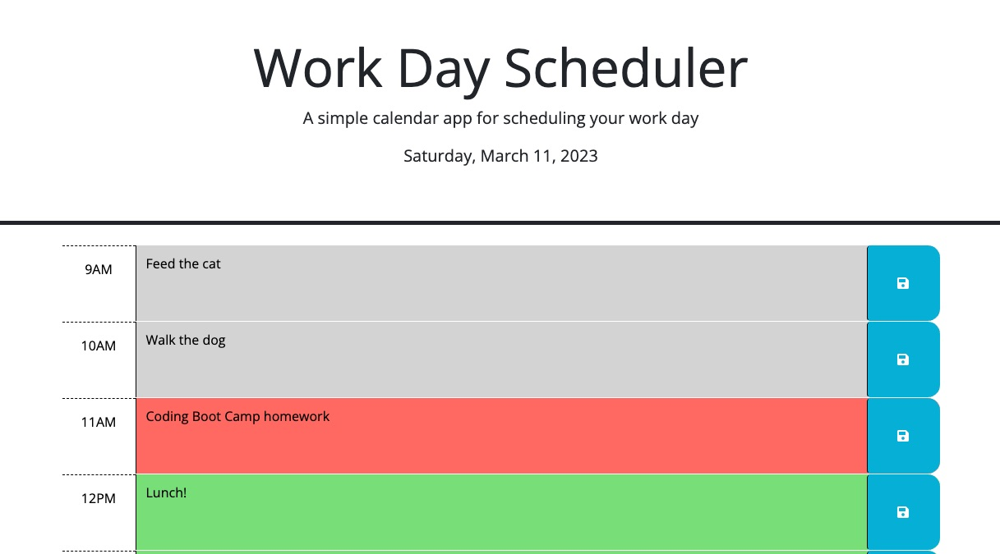

# Daily Planner

## Description

This project was built to help individuals plan out their working day hour by hour. The hours are color-coded to indicate past, present, and future hours.

## Installation

N/A

## Usage

View the [deployed application](https://sendusyourbones.github.io/daily-planner/).

- To add a task to an hour, click the rectangle for the hour and type the task to be completed. Click the Save icon.
- Hours that have passed will have a grey background
- The current hour will have a red background
- Future hours will have a green background

## Credits

- [Bootstrap](https://getbootstrap.com/) used for styling
- [jQuery](https://jquery.com/) used to manipulate elements and handle events
- [day.js](https://day.js.org/) used to get the current date and time

## License

MIT License